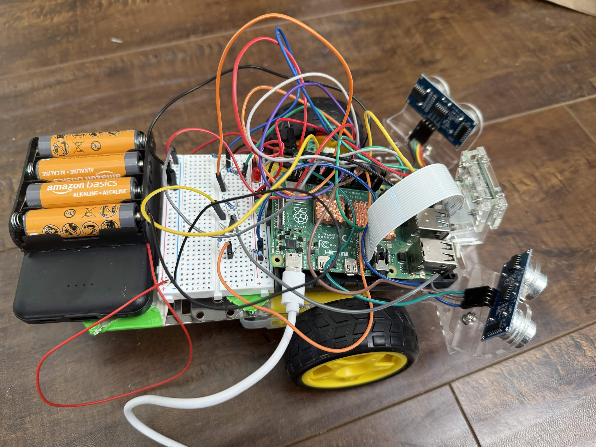

# Ball Tracking Robot

My project is the ball tracking robot and what it does is when it sees the ball, it will track it and go to it. I had a problems with my robot not working properly so through trial and error I found out that my problem was with my ultra sonic sensors. After that I was able to get my robot working, and add my modifications.

| **Engineer** | **School** | **Area of Interest** | **Grade** |
|:--:|:--:|:--:|:--:|
| Cody Z | Bishop Manogue Catholic High School | Aerospace Engineering | Incoming Sophomore |


  
# Final Milestone

<iframe width="560" height="315" src="https://www.youtube.com/embed/b1XDwiIc2_k?si=6sQTMjWyDeQyV9kK" title="YouTube video player" frameborder="0" allow="accelerometer; autoplay; clipboard-write; encrypted-media; gyroscope; picture-in-picture; web-share" referrerpolicy="strict-origin-when-cross-origin" allowfullscreen></iframe>

I added modifications to my robot. One of the modifications was that there are now two LEDs one is green and one is red. The green one will turn on when the robot sees the ball, and the red one turns on when the robot is searching for the ball. The other modification that I have added is that now the robot will push the ball when it gets too close to the robot. My biggest challenge at BSE was getting my code to work. My robot wasn't tracking the ball and I had to find the problem by trial and error. My biggest triumph was finding out that it was the ultra sonic sensors that weren't working so I was able to fix that by changing the code so it doesn't require the ultra sonic sensors. I learned about how raspberry pis work, and how to wiring things with a breadboard and a raspberry pi. It also allowed me to work with python code, and a red mask so my robot can detect the ball and go to it. I hope to learn more about wiring and programming so that I can work on more complicated projects by myself in the future.

# Second Milestone

<iframe width="560" height="315" src="https://www.youtube.com/embed/dnEYJEBreLs?si=okQe9FZYMKEDLFzQ" title="YouTube video player" frameborder="0" allow="accelerometer; autoplay; clipboard-write; encrypted-media; gyroscope; picture-in-picture; web-share" referrerpolicy="strict-origin-when-cross-origin" allowfullscreen></iframe>

I have added the code to allow the robot to track the ball, but when I tested the code, the robot seems to be avoiding the ball, and so I saw that one of the sensors was giving me a huge number so I ran my sensor test code, and one of the sensors was giving me a big number, so I checked my wiring, and didn't find a problem. I flipped the positions of the sensors to test the wires again, and found out that the original sensor that was giving me correct numbers was still giving me correct numbers and the other was giving me wrong numbers. This helped me determine that the sensor was broken, so I changed the code so that it didn't require the ultra sonic sensors. Now my robot can track and go to the ball so I finished my main project. What surprised me was that the sensor was broken and not my code which was what I was working on. This surprised me because the code was what I was working on, and so I thought the problem had to be the thing I was working on and not anything else. This just shows me that problems doesn't have to be from what you are currently working on, it could be from anything. The final thing that needs to be completed before my final milestone is fine tuning the code so the turns are smoother.

# First Milestone

<iframe width="560" height="315" src="https://www.youtube.com/embed/2xwQUjQNNbI?si=_U_fYGfVKooA2H8_" title="YouTube video player" frameborder="0" allow="accelerometer; autoplay; clipboard-write; encrypted-media; gyroscope; picture-in-picture; web-share" referrerpolicy="strict-origin-when-cross-origin" allowfullscreen></iframe>

My robot has many different components. The motors are connected to the wheels. This allows the robots to move around. There is a back wheel to make sure the robot is balanced and does not fall over. The motors are connected the motor driver module which tells the motors which way to spin so that the robot can go in the right direction. I have two ultra sonic sensors and their job is to tell the robot if there is a object infront of it so it doesn't crash into it. There is one camera on the front of the robot that detects if there is a ball infront of it. Problems I have faced are that I have not really worked with wiring a breadboard and a raspberry pi so it was confusing at first, but I did eventually get it working. My plan is to get the code working so my robot goes to the ball, and get my own modification on to the robot.

# Schematics 

!(Schematics for Ball Robot.jpg)

# Code

```c++
# import the necessary packages
from picamera2 import Picamera2
import RPi.GPIO as GPIO
import time
import cv2
import numpy as np
cv2.imshow("Camera feed", 1)
#hardware work
GPIO.setmode(GPIO.BOARD)
MOTOR1B=21  #Left Motor
MOTOR1E=19
MOTOR2B=18  #Right Motor
MOTOR2E=22 
RED_LED = 15 #If it finds the ball, then it will light up the led
GREEN_LED = 11
GPIO.setup(MOTOR1B, GPIO.OUT)
GPIO.setup(MOTOR1E, GPIO.OUT)
GPIO.setup(MOTOR2B, GPIO.OUT)
GPIO.setup(MOTOR2E, GPIO.OUT)
GPIO.setup(RED_LED, GPIO.OUT)
GPIO.setup(GREEN_LED, GPIO.OUT)

def forward():

      GPIO.output(MOTOR1B, GPIO.HIGH)
      GPIO.output(MOTOR1E, GPIO.LOW)
      GPIO.output(MOTOR2B, GPIO.HIGH)
      GPIO.output(MOTOR2E, GPIO.LOW)

def reverse():

      GPIO.output(MOTOR1B, GPIO.LOW)
      GPIO.output(MOTOR1E, GPIO.HIGH)
      GPIO.output(MOTOR2B, GPIO.LOW)
      GPIO.output(MOTOR2E, GPIO.HIGH)

def leftturn():

      GPIO.output(MOTOR1B, GPIO.LOW)
      GPIO.output(MOTOR1E, GPIO.HIGH)
      GPIO.output(MOTOR2B, GPIO.HIGH)
      GPIO.output(MOTOR2E, GPIO.LOW)

def rightturn():

      GPIO.output(MOTOR1B, GPIO.HIGH)
      GPIO.output(MOTOR1E, GPIO.LOW)
      GPIO.output(MOTOR2B, GPIO.LOW)
      GPIO.output(MOTOR2E, GPIO.HIGH)

def stop():

      GPIO.output(MOTOR1E, GPIO.LOW)
      GPIO.output(MOTOR1B, GPIO.LOW)
      GPIO.output(MOTOR2E, GPIO.LOW)
      GPIO.output(MOTOR2B, GPIO.LOW)
    
#Image analysis work

def segment_colour(frame):    #returns only the red colors in the frame
    hsv_roi = cv2.cvtColor(frame, cv2.COLOR_BGR2HSV)
    mask_1 = cv2.inRange(hsv_roi, np.array([160, 160, 10]), np.array([180, 255, 255]))
    ycr_roi = cv2.cvtColor(frame, cv2.COLOR_BGR2YCrCb)
    mask_2 = cv2.inRange(ycr_roi, np.array((0., 165., 0.)), np.array((255., 255., 255.)))
    mask = mask_1 | mask_2
    kern_dilate = np.ones((8,8),np.uint8)
    kern_erode  = np.ones((3,3),np.uint8)
    mask= cv2.erode(mask,kern_erode)
    mask=cv2.dilate(mask,kern_dilate)
    return mask

def find_blob(blob):
    largest_contour=0
    cont_index=0
    contours, hierarchy = cv2.findContours(blob, cv2.RETR_CCOMP, cv2.CHAIN_APPROX_SIMPLE)
    for idx, contour in enumerate(contours):
        area=cv2.contourArea(contour)
        if (area > largest_contour):
            largest_contour=area
            cont_index=idx
    r=(0,0,2,2)
    if len(contours) > 0:
        r = cv2.boundingRect(contours[cont_index])
    return r, largest_contour

def target_hist(frame):
    hsv_img=cv2.cvtColor(frame, cv2.COLOR_BGR2HSV)
    hist=cv2.calcHist([hsv_img],[0],None,[50],[0,255])
    return hist

#CAMERA CAPTURE
camera = Picamera2()
config = camera.create_preview_configuration(main={"size": (160, 120), "format": "RGB888"})
camera.configure(config)
camera.start()
time.sleep(0.1)
flag=0

while True:
      frame = camera.capture_array()
      centre_x=0.
      centre_y=0.
      mask_red=segment_colour(frame)
      loct,area=find_blob(mask_red)
      x,y,w,h=loct

      if area < 150:
            found=0
      else:
            found=1
            simg2 = cv2.rectangle(frame, (x,y), (x+w,y+h), 255,2)
            centre_x=x+((w)/2)
            centre_y=y+((h)/2)
            cv2.circle(frame,(int(centre_x),int(centre_y)),3,(0,110,255),-1)
            centre_x-=80
            centre_y=60-centre_y
            print(centre_x, centre_y)
      initial=400
      GPIO.output(GREEN_LED,GPIO.LOW)

      if(found==0):
            #if the ball is not found, spin in the last direction it was seen
            GPIO.output(RED_LED, GPIO.HIGH)
            if flag==0:
                  rightturn()
                  time.sleep(0.02)
            else:
                  leftturn()
                  time.sleep(0.02)
            stop()
            time.sleep(0.0125)
      elif(found==1):
            GPIO.output(GREEN_LED, GPIO.HIGH)
            GPIO.output(RED_LED, GPIO.LOW)
            if(area<initial):
                  #ball is far away, drive forward
                  forward()
                  time.sleep(0.00625)
            elif(area>=initial):
                  initial2=6700
                  if(area<initial2):
                        #ball is mid range, steer towards it then drive forward
                        if(centre_x<=-25 or centre_x>=25):
                              if(centre_x<0):
                                    flag=1
                                    leftturn()
                                    time.sleep(0.02)
                              elif(centre_x>0):
                                    flag=0
                                    rightturn()
                                    time.sleep(0.02)
                        forward()
                        time.sleep(0.00003125)
                        stop()
                        time.sleep(0.00625)
                  else:
                        # Ball is close enough - push it
                        GPIO.output(GREEN_LED, GPIO.HIGH)
                        forward()
                        time.sleep(1.5)   # Adjust this until it pushes the ball the right distance
                        stop()
                        time.sleep(0.5)
                        reverse()
                        time.sleep(0.5)
                        stop()
                        time.sleep(0.5)
      if(cv2.waitKey(1) & 0xff == ord('q')):
            break
camera.stop()
GPIO.cleanup()
```

# Bill of Materials

| **Part** | **Note** | **Price** | **Link** |
|:--:|:--:|:--:|:--:|
| Raspberry Pi Kit | Runs code and controls robot | $148.99 | <a href="https://www.amazon.com/RasTech-Raspberry-Starter-Heatsink-Screwdriver/dp/B0C8LV6VNZ/ref=sr_1_4?crid=3506HY00MCGVM&dib=eyJ2IjoiMSJ9._zkM62vSQ8p7tNr88715LdMv_qHh72Je-tkF9PXEa3chDE53QT4aZu4AGAb4ihE61QY4ZD55nKF6Fp2Kfs8t7AbafM_JrlJFfHo9OB4eAVGqa0EB-7aoBQHPmhKHZ2MW8ny-Kd44bMVlVxPlTWVk5YHIN5P3uKVqrE5Dcal0rKkHny-O6Xyb5ux2AOU6OwVbkag_bqBX66RQNRrgBuz-0pS43mcx93IZTQA9R8NaJJypYU2HAycp-XicTFmyU60a01Nfm9iuyo6B9yA8ppN3OQQyJ-NQ9xyNPxfTLwkqtng.yAYpU6outhQcZmOZhN9Wb6yTw7A85CNUbXZguGInZNg&dib_tag=se&keywords=raspberry%2Bpi%2Bkit&qid=1718848547&s=electronics&sprefix=rasbperry%2Bpi%2Bkit%2Celectronics%2C83&sr=1-4&th=1"> Link </a> |
| Robot Chassis | The main body of the robot | $13.99 | <a href="https://www.amazon.com/Smart-Chassis-Motors-Encoder-Battery/dp/B01LXY7CM3/ref=sr_1_5?crid=373Y5YK6JWMD&keywords=robot+chassis&qid=1687740144&sprefix=robot+chassi%2Caps%2C93&sr=8-5"> Link </a> |
| Screwdriver Kit | Used to assemble the robot | $7.99 | <a href="https://www.amazon.com/Small-Screwdriver-Set-Mini-Magnetic/dp/B08RYXKJW9/"> Link </a> |
| Ultrasonic Sensor | Detects nearby objects | $9.99 | <a href="https://www.amazon.com/WWZMDiB-HC-SR04-Ultrasonic-Distance-Measuring/dp/B0CQCCGXCP/ref=sr_1_1_sspa?crid=3J2JR973WKPHO&dib=eyJ2IjoiMSJ9.E2SIkElJhtFWCJCHL5Q6Y73Ys_HCMPRVFCIrG_zKv4Og7BdZNtr69Mkju140lhlfzFGQuY542jpsp8FMrtV9d2hCBI7D8lYTH9bcgDXZhs4941uj-d1D69ZYdKmAI1Jig3VmYXOl3axVQ8Jq5L3nGRymNMtNbxkaFqGNyzkq4p37hhxU6jheuoaMo3Onz2FE9ILThkjUbdxRNW3rrZgZ7bYj9mf-yav85hBAmNduYyo.EneY3GmHDfDjDwhdUdDQ4Ktk6fECH62Adb42cEkehRc&dib_tag=se&keywords=ultrasonic%2Bsensor&qid=1715961326&sprefix=ultrasonic%2Bsensor%2Caps%2C72&sr=8-1-spons&sp_csd=d2lkZ2V0TmFtZT1zcF9hdGY&th=1"> Link </a> |
| H Bridges | Controls direction and speed of motors | $8.99 | <a href="https://www.amazon.com/ACEIRMC-Stepper-Controller-2-5-12V-H-Bridge/dp/B0923VMKSZ/"> Link </a> |
| Pi Cam | Used to detect the ball | $9.99 | <a href="https://www.amazon.com/gp/product/B07RWCGX5K/ref=ox_sc_act_title_1?smid=A2IAB2RW3LLT8D&th=1"> Link </a> |
| Electronics Kit | Electronics for wiring the robot | $9.99 | <a href="https://www.amazon.com/EL-CK-002-Electronic-Breadboard-Capacitor-Potentiometer/dp/B01ERP6WL4/ref=sr_1_4?crid=30T5LTYVQLQ7Z&dib=eyJ2IjoiMSJ9.XZtpck6Llt4UIuYeKM4X3BoXzDuzolZMTCtFDj-oTh1vuIi0HYJZJEdpS-MCdGCK1AWUbUmgoEswoRPxGUSKeGRTzsciRE_l2Vrp8FGX1SxK-HmibPNyHBEtkFJKo_OYmMhkhdCJ4OIH38ALRfFvrXZ7OU5faZVvkTBqod8p7UZYwNwdLCcimwFWGWKaDa-gbbx_TGk7lYQmEbrzeL4UXM-gW3RDtuOV0dCykxwyvYJKCCcOhrK3f18N4NZjiqL_Y5noE1rQTmwyFcG67DzgpNaUPanwIQaYfCe5mgD-njY.v6mU1wYX4M5ShCiyrZMey0hbOwvqLszD8axpHbKlA6I&dib_tag=se&keywords=mini+breadboard+kit&qid=1716419767&s=electronics&sprefix=mini+breadboard+kit%2Celectronics%2C106&sr=1-4"> Link </a> |
| Motors | Turns the wheels so the robot can move | $9.99 | <a href="https://www.amazon.com/AEDIKO-Motor-Gearbox-200RPM-Ratio/dp/B09N6NXP4H/ref=sr_1_4?crid=1JP29NIWBLH2M&dib=eyJ2IjoiMSJ9.Wq3jKgOLbqtEP772vMD4pV5f-w3PLBdEpKqguykXOb0JFO14f4Dq0m_VDVUMUFtR8WFINUEticI3GXcoGqwXPqK9yIh04PhCktgccMz9zAUiKXMJPwmOTUp_6av3XuFD0lXo9WngN9iKI6YgZrhEEs9qnqbcB1GnvgntCdKz8Q1dFuNu61NgSE6Z8vBk3FRpaNcr1lCI7FApTiNi0Qce8gbfmMn6oUggZQHpIOKKZ6s.M7WsZ_ZZtm3rm93kKgw0NOxt1McVBYX6m55oGxu1xxI&dib_tag=se&keywords=dc+motor+with+gearbox&qid=1715911706&sprefix=dc+motor+with+gearbox%2Caps%2C126&sr=8-4"> Link </a> |
| DMM | Used to troubleshoot electrical circuits | $9.98 | <a href="https://www.amazon.com/dp/B0CXM242J1?ref=fed_asin_title&th=1"> Link </a> |
| Champion sports ball | The ball that the robot has to track | $14.95 | <a href="https://www.amazon.com/Champion-Sports-Inch-Coated-Density/dp/B000KYTTYO/ref=sr_1_2_sspa?dib=eyJ2IjoiMSJ9.TLCeZ2jjYwnvK3RiJf14C4RstYOZXhRWTRbHkmLGiNfm5Vd8mVjvtsbUnBFk0S4d6cW9cPT7XDdhwMcPC30nsNwer7Uim0JVF49R8Od82u3RH4TY4mO1uP5LtqdvIEcW7CaOm7AzQ6xOvWQ4say1Ci9eGOxETDRWJP5rewLnqARbrvbe4kh-b2d5NHCLEsarPl16pM1UVlmQCXfMRksXigf_GpckmWPjeUM1AC8iiU0.lGUWr3-ZcZJNl0nJ2JaU6JEUOF9oR26lf0kUvETdmtM&dib_tag=se&keywords=7%2Binch%2Bred%2Bball&qid=1748284272&sr=8-2-spons&sp_csd=d2lkZ2V0TmFtZT1zcF9hdGY&th=1"> Link </a> |
| AA batteries | Used to power the motors | $18.74 | <a href="https://www.amazon.com/Arduino-A000066-ARDUINO-UNO-R3/dp/B008GRTSV6/](https://www.amazon.com/Duracell-Coppertop-AA-Ingredients-Long-lasting/dp/B0035LCFNQ/ref=sr_1_2_sspa?crid=2YR65MVXWA50C&dib=eyJ2IjoiMSJ9.Y7LKJBX-6tZ05fw4EcW76nu14zklVu0uDSTwj-0-cV44GfYvoaYnLKVwcPIB1rWt_qVnpkZnwoqkvrQmMFQ1qiTWN_rokxCgCagwBWaAIiv9PAbMqrwOrkGuvfWfklSZi5Y9W6AaUUspAaSMBZuUyS4cUoJB-s35FE-4seDyYIxfOaNAZggr154hcf3CR015QRyanTdKe1P3g2-fihntxqYoU2ek7H01s8toH4MNd-E.Mnyne8z1KkhvfDMnfFLgjUB9WgjdkdMcYRL591Pngbk&dib_tag=se&keywords=aa%2Bbatteries&qid=1748284893&refinements=p_85%3A2470955011&refresh=1&rnid=2470954011&rps=1&sprefix=aa%2Bbatterie%2Caps%2C122&sr=8-2-spons&sp_csd=d2lkZ2V0TmFtZT1zcF9hdGY&th=1"> Link </a> |
| USB power bank & cable | Used to power the sensors, camera, and raspberry pi | $32.99 | <a href="https://www.amazon.com/SIXTHGU-Portable-Charger-Charging-Flashlight/dp/B0C7PHKKNK/ref=sr_1_2_sspa?crid=2ZZM4AAZMMWHQ&dib=eyJ2IjoiMSJ9.W2Zx5_I3mKOn6UpwAzOw6PD0PNh1iaMRBiedequdv9weeWL0HPyPcxJBR9h6-LiFW-sHKnHSApN0sUxx0Q9xIRs80R57IlvvCsmEzXcktogo-4nP-NxrEZOy5dJTcXY8N-PBwfGt4fl_9LP8npenzDUV9TPA8KN6DMu175g6JegC_gZhAJrbqX94EfpQhLwP9vIJH45w2N-AFrfZZOy9jqk55gzVyk4Qst8uZvqn768.KBrc5_SqZ4e8zCpoFc-1C7rk02t3o2ykgDPB65W5JJU&dib_tag=se&keywords=always%2Bon%2Bpower%2Bbank&qid=1715957917&sprefix=always%2Bon%2Bpower%2Bbank%2Caps%2C107&sr=8-2-spons&sp_csd=d2lkZ2V0TmFtZT1zcF9hdGY&th=1"> Link </a> |

# Other Resources/Examples

- [Instructions for Ball Tracking Robot]([https://trashytuber.github.io/YimingJiaBlueStamp/](https://www.instructables.com/Ball-Tracking-Robot/))
